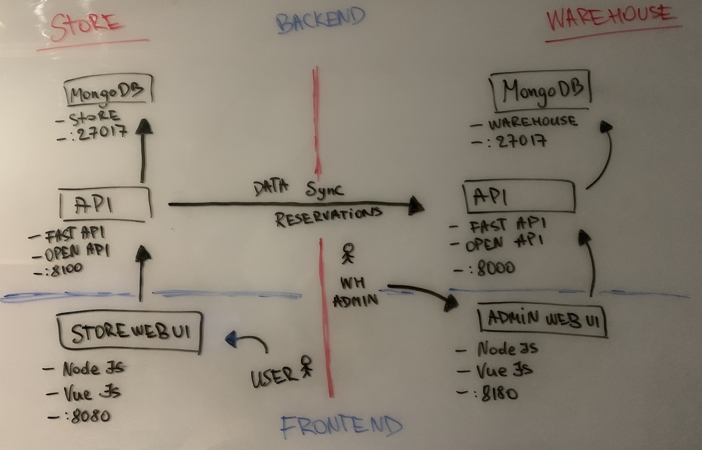

# via-ecommerse

Project for e-commerse systems course to demonstrate Consumer and API system collaboration and arhitecture.



## Components

### Warehouse

See [warehouse/README.md](warehouse/README.md)

- API, requires MongoDB
- WEB, requires warehouse API

### Store

See [store/README.md](store/README.md)

- API, standalone, but some functionality requires reachable Warehouse API
- WEB, requires store API

## How to run it

Clone the repository
```
git clone git@github.com:jpuris/via-ecommerse
cd via-ecommerse
```

### Docker

Requires
- Docker
- Docker compose

Creates following environment (default envs). Make sure these ports are available on your system.

- `via-ecommerse-warehouse-backend-db` no exposed ports, accessible only via warehouse docker network
- `via-ecommerse-warehouse-backend-api` exposes port 8000
- `via-ecommerse-warehouse-frontend` exposes port 8180

- `via-ecommerse-store-backend-db` no exposed ports, accessible only via warehouse store network
- `via-ecommerse-store-backend-api` exposes port 8100
- `via-ecommerse-store-frontend` exposes port 8080

```sh
docker-compose up --build 
```

#### Warehouse services

- Access the OpenAPI UI at http://localhost:8000/docs
- Access the WEB UI at http://localhost:8180

#### Store services

- Access the OpenAPI UI at http://localhost:8100/docs
- Access the WEB UI at http://localhost:8080

### Docker cleanup

```shell
docker-compose rm
```
